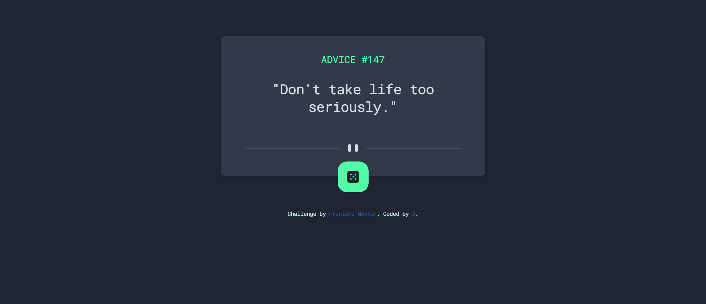
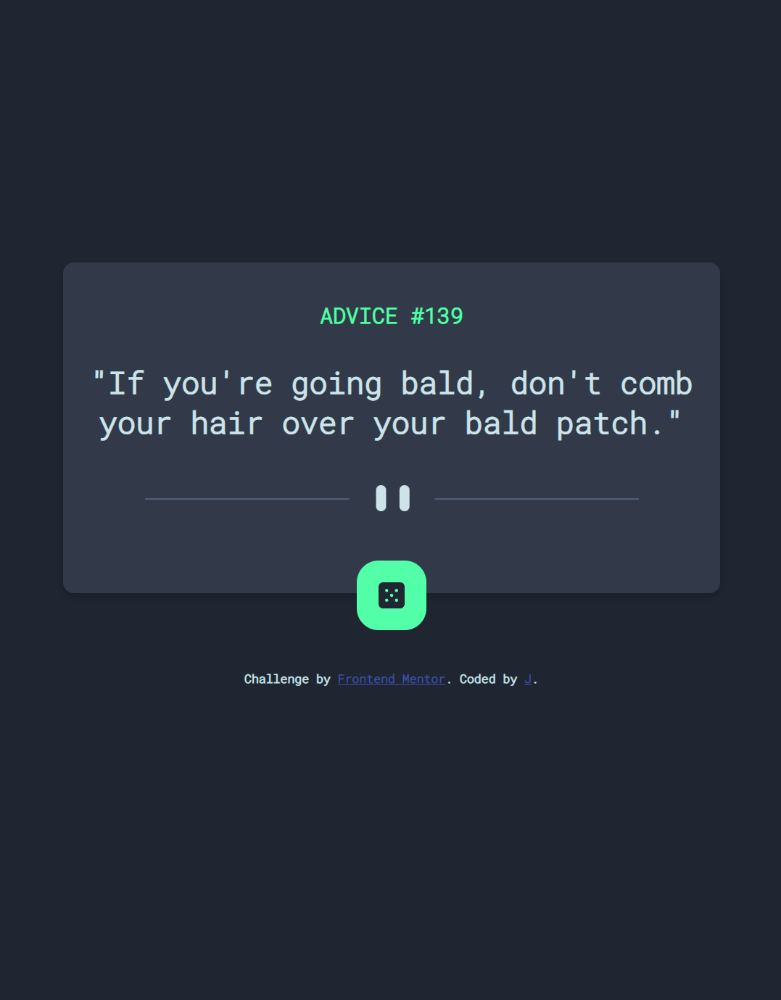

# Frontend Mentor - Advice generator app solution

This is a solution to the [Advice generator app challenge on Frontend Mentor](https://www.frontendmentor.io/challenges/advice-generator-app-QdUG-13db).

## Table of contents

- [Overview](#overview)
  - [The challenge](#the-challenge)
  - [Screenshot](#screenshot)
  - [Links](#links)
- [My process](#my-process)
  - [Built with](#built-with)
  - [What I learned](#what-i-learned)
  - [Useful resources](#useful-resources)
- [Author](#author)
- [Acknowledgments](#acknowledgments)

## Overview

### The challenge

Users should be able to:
click on the dice button
and recieve advice from 
the adviceSlip API
- 

### Screenshot



### Links

- Solution URL: [solution URL](https://www.frontendmentor.io/solutions/advice-generator-app-YcdwDlFcC)
- Live Site URL: [Netlify URL](https://getadviceapp.netlify.app/)

## My process

### Built with
- Semantic HTML5 markup
- CSS custom properties
- Flexbox
- Mobile-first workflow
- [Advice api](https://api.adviceslip.com/) - API website

### What I learned

This WebApp was mostly a refresher on concepts I had learned earlier. I have been busy with school and other things which ultimately left me feeling a little rusty with Web Development in general. Overall, I feel quite happy with my solution to this challenge and I think it came out great.


```css
.proud-of-this-css {
  all: unset; /* cool way to remove default styling/
}
```
### Useful resources

- [CSS Tricks](https://css-tricks.com/) - This site helped me create good looking css. I'd recommend it to anyone who feels like they could improve in css. It has many great tips and I refrence this site a ton whenever I create new projects.
- [FlexboxGuide](https://css-tricks.com/snippets/css/a-guide-to-flexbox/) - This is an amazing article which helped me finally understand flexbox. I hadnt used flexbox in a while so I was a little rusty but this article really helped me refresh my memory.
- [Removing default css](https://css-tricks.com/overriding-default-button-styles/) - A great article about removing default css.
## Author
- Frontend Mentor - [@Jman1868](https://www.frontendmentor.io/profile/Jman1868)
## Acknowledgments

I want to thank FrontendMentor for creating this challenge. It felt nice to follow a design and create something.
